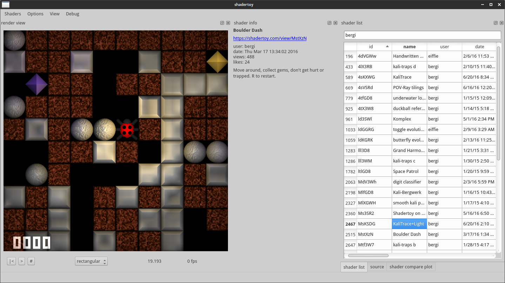

# Off-line Shadertoy renderer

This is a Qt-based desktop application for downloading, managing and rendering programs from https://www.shadertoy.com

It's under development and currently supports a subset of the features. See details below...

License: MIT

### Current state of things

The whole project tries to be Qt-selfcontained, meaning there are no 3rd libraries yet. There is a basic GUI, somewhat mimicking the shadertoy.com interface and json-wrappers, file cache and render classes.

There is a ShaderListModel and a ShaderSortModel to display shaders in a QTableView and perform full-text search, filtering and sorting for all shader properties. Through the ShadertoyApi class, the model downloads the shader ids and merges the file cache with the web data for each shader, resulting in a folder with separate .json files, which is then loaded on each startup.

You can display and run shaders similiar to the web interface. Also it's possible to edit the code and change some texture input properties. But saving is not supported yet.

It uses QOpenGLFunctions and all that stuff to render shaders either onto a QWidget or offscreen into a QImage. I don't like the QOpenGL* wrappers because they tend to crash the program more often than my own opengl code normally does. This should really be refactured! Apart from that, the screen refresh is not tightly 60 fps and blocks the GUI somewhat. Maybe i'll try Qt's new 3D-API at some point..

### Compatibility

On Sunday, 9th Oct. 2016, there were 3771 programs in the public-API ;-)

Of these, 8 shaders either segfault somewhere in QOpenGLShaderProgram::link(), or the first occurence of glClear() blocks forever. ??

334 shaders do not compile. This is probably more than on my regular Ubuntu14/QuadroK1000M/Firefox setup. Many shaders that do not compile use the `cond ? a += x : b += x` trick which seems to work in WebGL but fails in non-WebGL.

### List of supported things

    * 2d textures + mipmap (no cube-maps yet)
    * multi-pass rendering (probably still a few bugs there with some shaders)
    * mouse input
    * support of mainVR() function for fisheye and cross-eye-view images

Missing is the whole audio/camera/video input..

### Rationale

This is more or less a test-bed to enable any kind of shadertoy program to be executed locally and..

    * replace inputs (own textures, audio streams, video files)
    * render to disk in super-HQ
    * perform live
    * exploit mainVR() function in any kind of way ;)
    * manage programs, collections and help searching for particular effects
    * add certain features to programs and save to 'library', e.g. the mainVR() function, audio-reactiveness, osc input, ...
    * maybe create a public repo where people can fork and add features
